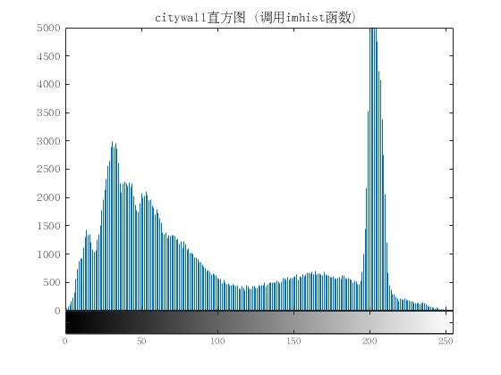

# 数字图像处理作业报告
## 报告信息
### 名称：数字图像处理第三次作业
### 姓名：翟宏佳
### 班级：电信钱61
### 学号：2160405066

## 第一题 :把附件图像的直方图画出

图像直方图由于其计算代价较小,且具有图像平移、旋转、缩放不变性等众多优点,
广泛地应用于图像处理的各个领域,特别是灰度图像的阈值分割、基于颜色的图像检索
以及图像分类。
强度直方图图形化显示不同的像素值在不同的强度值上的出现频率,对于灰度图像
来说强度范围为[0~255]之间,对于 RGB 的彩色图像可以独立显示三种颜色的强度直方
图。

结果：

## 第二题 :把所有图像进行直方图均衡；输出均衡后的图像和源图像进行比对；分析改善内容；

## 第三题 :进一步把图像按照对源图像直方图的观察，各自自行指定不同源图像的直方图，进行直方图匹配，进行图像增强；

## 第四题 :对elain和lena图像进行7*7的局部直方图增强；

## 第五题 :利用直方图对图像elain和woman进行分割；

